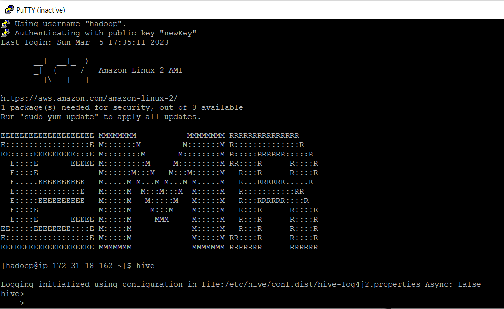
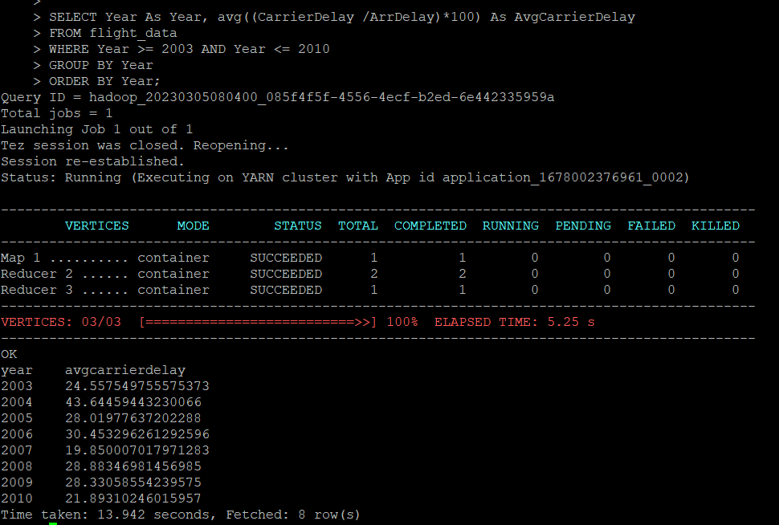
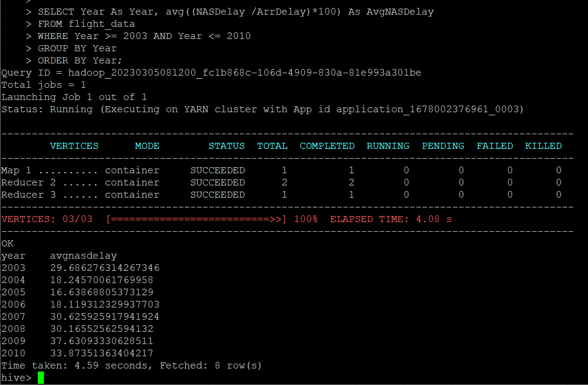
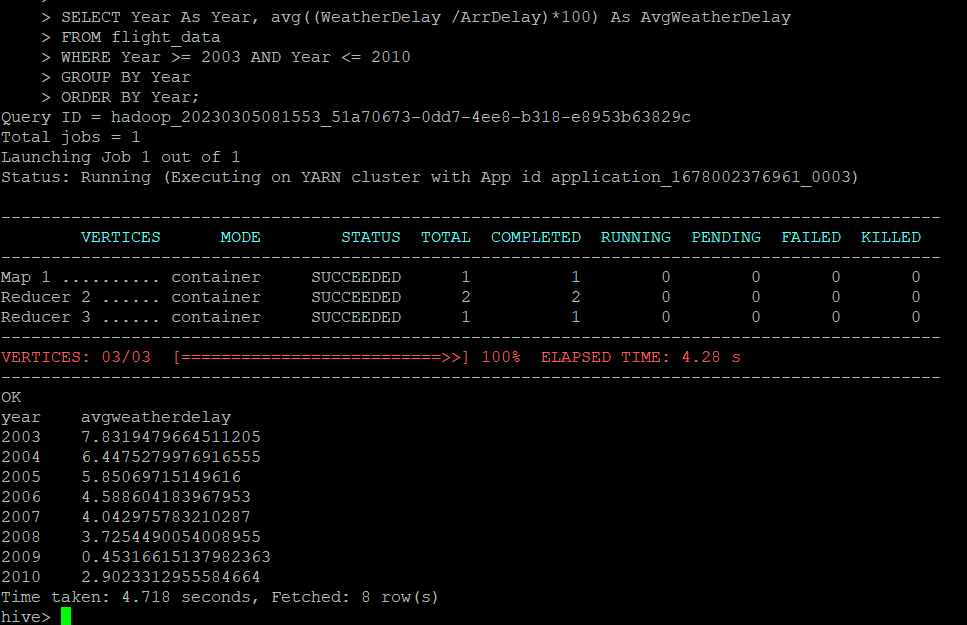
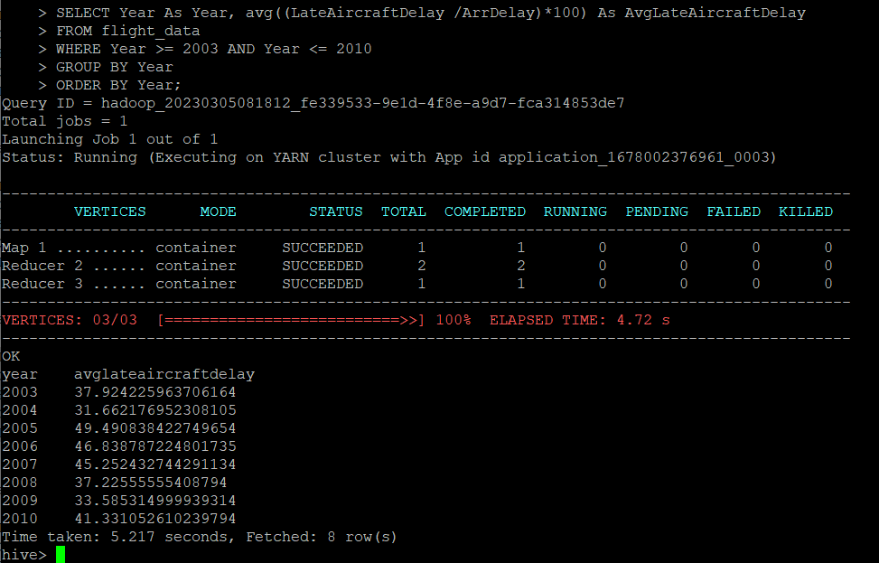
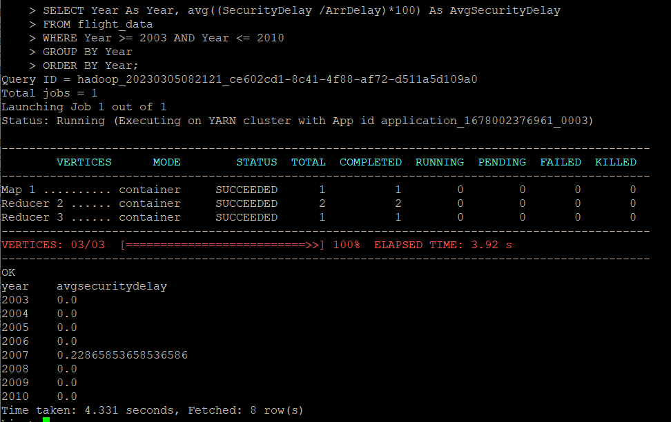

# UoM_MapReduce-vs-Spark

1. Connect to EMR Cluster though SSH



2. Create Table 

```
CREATE EXTERNAL TABLE IF NOT EXISTS flight_data(
  Counter int,
  Year int, 
  Month int,
  DayofMonth int,
  DayOfWeek int,
  DepTime int,
  CRSDepTime int,
  ArrTime int,
  CRSArrTime int,
  UniqueCarrier string,
  FlightNum int,
  TailNum string,
  ActualElapsedTime int,
  CRSElapsedTime int,
  AirTime int,
  ArrDelay int,
  DepDelay int,
  Origin string,
  Dest string,
  Distance int,
  TaxiIn int,
  TaxiOut int,
  Cancelled string,
  CancellationCode string,
  Diverted string,
  CarrierDelay int,
  WeatherDelay int,
  NASDelay int,
  SecurityDelay int,
  LateAircraftDelay int
)
ROW FORMAT DELIMITED 
FIELDS TERMINATED BY ',' 
LOCATION '/user/tables/flight_data';
```

3. Load Data 

```
LOAD DATA INPATH '<s3 bucket link>' OVERWRITE INTO TABLE delayedFlights;
```

Now the data loaded to table, so we can run quaries


#### The airlines market has been faced losses due to the flight delay and there are many reasons for delaying a flight. In this Analysis, you need to analyse the various delay happens in airlines per year and run the queries as follows.

1. Year wise carrier delay from 2003-2010

```
SELECT Year As Year, avg((CarrierDelay /ArrDelay)*100) As AvgCarrierDelay
FROM flight_data
WHERE Year >= 2003 AND Year <= 2010
GROUP BY Year
ORDER BY Year;
```



2. Year wise NAS delay from 2003-2010
```
SELECT Year As Year, avg((NASDelay /ArrDelay)*100) As AvgNASDelay
FROM flight_data
WHERE Year >= 2003 AND Year <= 2010
GROUP BY Year
ORDER BY Year;
```



3. Year wise Weather delay from 2003-2010
```
SELECT Year As Year, avg((WeatherDelay /ArrDelay)*100) As AvgWeatherDelay
FROM flight_data
WHERE Year >= 2003 AND Year <= 2010
GROUP BY Year
ORDER BY Year;
```


4. Year wise late aircraft delay from 2003-2010
```
SELECT Year As Year, avg((LateAircraftDelay /ArrDelay)*100) As AvgLateAircraftDelay
FROM flight_data
WHERE Year >= 2003 AND Year <= 2010
GROUP BY Year
ORDER BY Year;
```


5. Year wise security delay from 2003-2010
```
SELECT Year As Year, avg((SecurityDelay /ArrDelay)*100) As AvgSecurityDelay
FROM flight_data
WHERE Year >= 2003 AND Year <= 2010
GROUP BY Year
ORDER BY Year;
```



